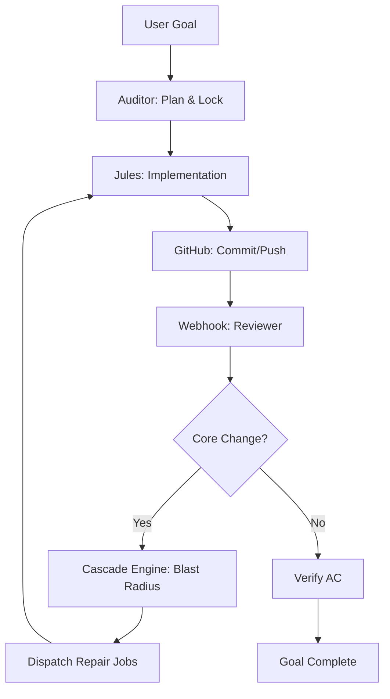

# NexusAI: The Self-Building Loop

NexusAI is designed as an autonomous, self-healing repository management system. It operates on a **3-agent recursive loop** that ensures architectural integrity by detecting, analyzing, and repairing downstream breakages caused by "core" changes.

## 1. System Architecture

The loop is composed of three specialized stages that handle the lifecycle of a code change:

### Stage 1: Preprocessing (The Auditor/Orchestrator)
**Goal:** Strategy and Safety.
- **Goal Decomposition:** Analyzes high-level user goals and breaks them into discrete tasks.
- **Blast Radius Analysis:** Predicts which files will be impacted by a change, specifically monitoring "Core Files" (e.g., `src/db/schema.ts`, `src/lib/types.ts`).
- **Concurrency Management:** Uses the `Lock Manager` to prevent multiple agents from modifying the same files simultaneously, ensuring stable parallel execution.

### Stage 2: Execution (Jules)
**Goal:** Implementation.
- **Remote Environment:** Jules agents execute coding tasks in isolated environments synchronized with the repository.
- **Focused Execution:** Each agent receives a specific "Repair Job" prompt with precise file targets and constraints.
- **Branch Strategy:** Agents work on feature branches that are automatically kept in sync with the latest repository state.

### Stage 3: Postprocessing (The Reviewer & Cascade Engine)
**Goal:** Verification and Recursive Repair.
- **GitHub Webhook Integration:** Reacts to `push` and `pull_request` events to trigger immediate post-implementation reviews.
- **Diff-Aware Review:** Fetches the actual git diff (via the `GitHubClient`) to analyze semantic changes rather than just file lists.
- **Acceptance Criteria (AC) Validation:** Checks the committed work against the original goal's AC using high-reasoning LLMs.
- **Recursive Dispatch:** If a core change is detected, the **Cascade Engine** identifies downstream files that require updates and dispatches new Jules sessions to fix them.

---

## 2. The Cascade Mechanism ("Self-Building")

The "self-building" property of NexusAI comes from its ability to react to its own modifications.

1. **Detection:** A commit modifies a file defined in `src/lib/cascade-config.ts` (e.g., adding a field to the database schema).
2. **Analysis:** The `Cascade Engine` uses the git diff to understand the change's intent and scans the repository for dependencies.
3. **Decomposition:** It generates a set of **Repair Jobs** (e.g., "Update the API routes to handle the new schema field," "Fix the frontend types to include the new field").
4. **Autonomous Dispatch:** Multiple Jules agents are spawned in parallel to apply these repairs.
5. **Stability:** Each repair commit is itself reviewed by the loop, continuing until no more "drift" or "breakage" is detected.

---

## 3. Key Development Milestones

### The `cascade` Branch
Introduced the fundamental "Blast Radius" logic and the `cascades` data model. This branch established the `analyzeCascade` and `dispatchCascadeRepairs` functions, allowing the system to handle multiple parallel repair sessions.

### The `feat-github-webhook-diff` Branch (Current)
This branch added the **High-Fidelity Fetcher** to the `GitHubClient`. 
- **Work Completed:** Implemented `getCommitDiff` and `getPullRequestDiff` using the GitHub REST API with `application/vnd.github.v3.diff` headers.
- **Impact:** The Auditor can now see the *content* of changes within the webhook lifecycle, allowing for precise repair prompt generation and drastically reducing "hallucinated" repairs.

---

## 4. Self-Loop Prevention

A critical feature of any self-building loop is preventing infinite recursion. NexusAI implements multiple safety layers:
- **Automated Author Detection:** Webhooks ignore commits from authors with "jules" in their name or those marked with the `[Nexus-Auto]` tag.
- **Commit Message Parsing:** Scans commit messages for specific tokens that indicate the commit was generated by an internal agent.
- **Drift Thresholds:** The `Auto-Reviewer` only triggers manual interventions if "Major Drift" is detected, preventing the loop from getting stuck in minor stylistic corrections.

---

## 5. Verification & Testing

The work in the current branch includes rigorous testing of the loop's reactivity:
- **Signature Verification:** Ensures all incoming webhooks are legitimately from GitHub using HMAC-SHA256.
- **Integration Tests:** `src/app/api/webhooks/github/route.test.ts` validates that:
  - Human commits correctly trigger the `Auto-Reviewer` and `Cascade Engine`.
  - Automated commits are successfully identified and ignored.
  - Core file changes in `push` events correctly dispatch analysis to `/api/cascade/analyze`.

---

## 6. Operational Flow

## 5. Critical Components
- **`src/lib/cascade-config.ts`**: The source of truth for architectural boundaries.
- **`src/lib/registry/lock-manager.ts`**: The traffic controller for parallel agents.
- **`src/lib/auditor/cascade-engine.ts`**: The intelligence behind the self-healing loop.
- **`src/lib/github/octokit.ts`**: The interface for repo state retrieval.
